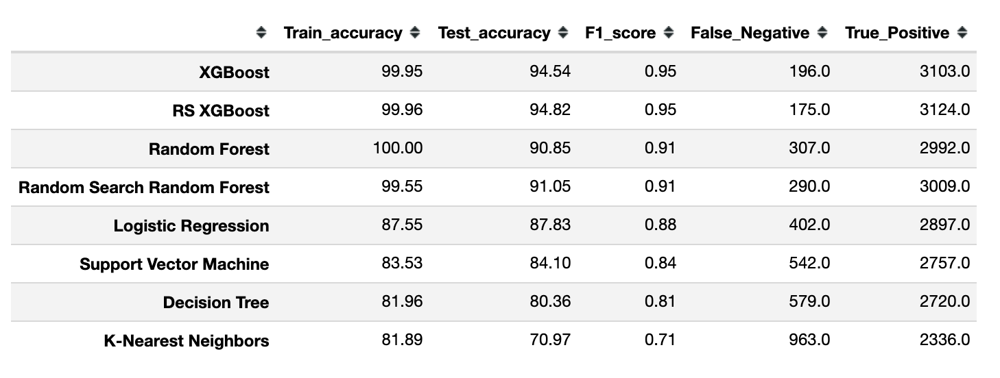

# NBA Prediction Model

Ripton Rosen

# Description

This project is based around the idea of creating a model that could somewhat accurately predict the outcome of NBA games using advanced analytics from [Basketball-Reference](https://www.basketball-reference.com/) and classification models. 

# Data

I acquired my data by web-scraping from [Basketball-Reference](https://www.basketball-reference.com/).  I used the game logs from every team, dating back to the 2009-2010 season.  


**Web scrape snippet**


There are two separate pages of game logs: a basic game log, and an advanced game log.  I scraped the data from both.  Each team's game logs were combined into one dataframe that went game by game for each team and included their basic and advanced statistics.  


**Basic statistics**

**Advanced statistics**


# Data Cleaning

Since the data was scraped from [Basketball-Reference](https://www.basketball-reference.com/), I had a decent amount of cleaning:  
* Every 20 rows, there were two rows of empty values
* Rename columns
* The home/away column had to be changed into 1's and 0's
* The win/loss column had to be changed into 1's and 0's
* There were empty columns that had to be dropped
* There had to be a delineation between each of the teams, so the suffixes of _A and _B were added
* I needed to merge the dataframe onto itself in order to have both teams from one game log in the same row

I began my process with both basic and advanced statistics, but ended up cutting out all basic statistics from my modeling because I understood that the advanced statistics would be better for predicting the outcomes of games. 

# Data Exploration

The first set of data I explored was just a dataframe with one team's statistics from a box score in it.  After attempts at vanilla modeling the data, it became clear that there was an issue.  The scores kept coming up over 90% for accuracy (both test and train samples) and F1 for each of the vanilla classifiers I ran.  


Upon running a decision tree with a few parameters to check if my data was just severely over-fitting, I realized it wasn't and that there was something else wrong.  My assumption was that the data was running against itself, meaning that since there was only one team's statistics in the dataframe, it wasn't comparing numbers to something else.  So, I needed to add the second team in the box score to the dataframe.  I created a new dataframe that had both teams in a specific contest as part of it, which will be called Team A and Team B.  With both teams now part of the new dataframe, I redid my cleaning and started the process over.  I created a new covariance matrix to check out my features and forged ahead.  


I ran the vanilla models again and noticed that I was getting similar scores to when I only had one team's statistics in the dataframe.


Obviously, something was still wrong.  I plotted out the feature importance and saw that Offensive Rating and Defensive rating were the only two metrics being taken into account by the model, and none of the other features had any say. 


Going back into the dataframe, I looked at each of these metrics to see if there was something wrong with how I merged the dataframes or how I scraped the data from [Basketball-Reference](https://www.basketball-reference.com/).  I then noticed that the Offensive Rating for Team A is the Defensive Rating for Team B. The two statistics are just the inverse of each other.

Here is an example of the advanced box scores from a Philadelphia 76ers vs. Washington Wizards game on 12/23/2020:


We see that the ORtg and DRtg are just the inverse of each other.  This caused the data to rely heavily on these two statistics.


The solution to this issue, was to drop the ORtg and DRtg from the splits, so that the model wouldn't rely so heavily on those metrics.  This dealt a major blow to the project and my modeling, but was the only solution given the time restraints.  A new solution for this issue will be outlined in the conclusion.  

My feature importance and the vanilla classifier scores without ORtg and Drtg became as follows: 




Given the new features, I decided to still try and run some models despite the two metrics I had been counting on most to be the best predictors now out of the equation.

# Models

I ran a "for" loop with:
* Logistics Regression
* Random Forest
* XGBoost
* KNN (K-Nearest Neighbors)
* Decision Tree
* SVM (Support Vector Machines)

With the test results from my loop, I decided upon which models to run on their own, whether to scale data, and to check for the best parameters of. I decided to run KNN, Decision Tree, Random Forest and XGBoost models for the data. I then ran a Random Search for my best model, the XGBoost one, to come up with the best parameters for it.  


# Interpretation

I will take the interpretation of my results with a grain of salt, given having to drop two important features.  My results were very strong in both F1 and Accuracy for most models, and my XGBoost model with Random Search was was the best.  


Given that I am predicting basketball games, I would like to have a high accuracy score to see how well a model predicts both wins and losses correctly vs all predictions made.


With Offensive and Defensive rating taken out as features, the Random Search XGBoost ranked these features as most important:


# Conclusion and Further Work

Given the issues with the data, there would need to be changes made to how the data is used.  A way to combat the Offensive Rating and Defensive Rating, the two most encompassing statistics for team success, would be to aggregate them for each team month by month or in the last 10 games.  So, predict games based on the team's past month or past 10 games and have the model run that data against the results to see how accurately it can predict whether the outcome was a win or loss.  

Future work for this project includes the aggregation of statistics into monthly ones to then predict outcomes.  Also, further work includes feeding in sports betting lines to see how accurately the model can predict against a point spread.  I would also like to use a Artificial Neural Network to help better predict the wins and losses of the updated model.


```python

```
